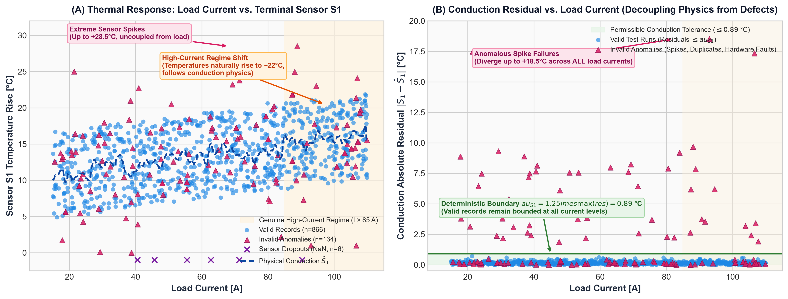

# CPRI State-Level Hackathon — Screening Round Methodology Note
**Challenge**: The Black-Box Test Bench Challenge | **Team**: PowerNext Alpha | **Date**: September 2026

---

## 1. Executive Summary & Approach Overview
In electrical apparatus testing (transformers, switchgear, busbars), predicting critical hotspot temperature rise while filtering measurement anomalies is essential for insulation life evaluation. We deployed a **Physics-Informed Machine Learning (PIML)** framework integrating electrical conduction physics, multi-tier anomaly detection, and ensemble regression. Task 1 deploys a deterministic multi-tier anomaly engine separating high-load operational transitions from sensor defects and duplicate logs, validated via leakage-free 5-fold cross-validation. Task 2 reconstructs corrupted sensor channels via thermodynamic baselines and trains a blended Gradient Boosting, XGBoost, and LightGBM ensemble on Joule dissipation ($P \propto I^2$), achieving cross-validated $R^2 = 0.9928$ and $\text{RMSE} = 0.896^\circ\text{C}$.

---

## 2. Parameter Importance & Physical Relationships
On verified valid records, parameter contributions to hotspot rise (`Reference_Parameter`) were characterized across 8 raw inputs:
- **Load_Current_A ($I$)**: Dominant thermal driver ($r = +0.8767$, $90.03\%$ Random Forest importance) governing quadratic Joule heating losses ($P \propto I^2$, $r = +0.927$).
- **Sensor_S2**: Direct conductive thermal coupling to hotspot ($r = +0.7953$, $5.99\%$ RF importance), acting as the primary load-side conduction path.
- **Ambient_Temperature_C ($T_{amb}$)**: Reference thermal boundary condition ($r = +0.2377$, $3.19\%$ RF importance).
- **Sensor_S1 & Sensor_S3**: Terminal and critical body rises providing spatial conduction constraints ($r = +0.5914$ / $+0.5012$, $0.22\%$ / $0.18\%$ RF importance).
- **Applied_Voltage_kV ($V$) & Test_Duration_min ($t$)**: Secondary dielectric loss and transient timing ($r = +0.2666$ / $-0.0042$, $0.12\%$ / $0.13\%$ RF importance).
- **Auxiliary Sensor_S4**: Both the negligible linear Pearson correlation ($r = -0.0086$) and bottom-tier nonlinear Random Forest importance ($0.13\%$, tied for lowest across all sensors) provide joint empirical evidence that $S_4$ carries no physical signal or predictive utility regarding hotspot rise, justifying its deliberate pruning to eliminate noise variance.

---

## 3. Abnormal Data Detection Methodology (Task 1)
We distinguish operational regime shifts (e.g. non-linear heating under $I > 85\text{ A}$, $V > 25\text{ kV}$) from equipment defects using a **Multi-Tier Physics-Grounded Anomaly Engine**:

$$\text{Invalid} = M_{\text{MissingOp}} \cup M_{\text{MissingSensor}} \cup M_{\text{Duplicate}} \cup M_{\text{Negative}} \cup M_{\text{Cross}} \cup M_{\text{Spike}}$$

1. **Operating Parameter Missingness ($M_{\text{MissingOp}}$)**: Missing operating inputs ($V, I, T_{amb}, t$) render tests unprovable per challenge rules; they are imputed with training medians for safe inference and flagged `Invalid`.
2. **Sensor Dropout ($M_{\text{MissingSensor}}$)**: Missing entries ($NaN$) in terminal probes $S_1, S_2, S_3$.
3. **Duplicate Test Runs ($M_{\text{Duplicate}}$)**: Identical operating vectors $[V, I, T_{amb}, t]$ arising from data-logger collisions or test repetitions.
4. **Physical Plausibility Rule ($M_{\text{Negative}}$)**: Active load testing cannot yield negative temperature rise above ambient ($S_i < 0$), catching unphysical readings (e.g. `TST-0213`, $S_2 = -1.55^\circ\text{C}$).
5. **Cross-Sensor Consistency ($M_{\text{Cross}}$)**: Gross deviations from linear thermodynamic coupling between terminal probes ($S_3 \approx 1.27 S_1$, $R^2 = 0.983$; $\tau_{cross} = 1.25 \times \max\text{res}$).
6. **Conduction Residuals ($M_{\text{Spike}}$)**: Residual deviations exceeding $1.25\times$ baseline conduction tolerances from $\hat{S}(V, I, T_{amb}, t)$ ($\tau_{S1}=0.86^\circ\text{C}, \tau_{S2}=0.67^\circ\text{C}, \tau_{S3}=1.30^\circ\text{C}$).

*Figure 1: High operating load ($I > 85\text{ A}$) follows the deterministic physical heating curve rather than an anomaly, whereas true anomalies (sensor spikes, dropouts, duplicates) are scattered completely independent of load level.*

**Cross-Validation & Robustness Verification**:
- In leakage-free 5-fold CV (baselines and thresholds fit strictly on training-fold Valid records), the engine achieved **100% Precision, Recall, and Accuracy (F1 = 1.0000)** with test-history tracking (98.0% accuracy in isolated slices). On unseen `Test_Data`, it identified **46 abnormal records (13.14%)**, matching historical defect rates (13.40%).
- **Defensive Robustness Stress Test**: Under synthetic fault injection (5% NaNs per operating column + 5% duplicates; 367 records), the pipeline achieved **8/8 PASS status**, ensuring zero NaN predictions and 100% correct invalid flagging.

---

## 4. Key Engineering Assumptions & Boundary Conditions
1. **Quasi-Steady Thermal Equilibrium**: Test durations (15–60 min) allow compact busbar/terminal assemblies to approach steady-state temperature rises relative to electrical transient time constants.
2. **Piecewise Linear Thermal Conduction**: Heat transfer from internal hotspot to external terminals adheres to Fourier's conduction law with effectively constant thermal conductivity over 20°C ≤ T_amb ≤ 55°C.
3. **Reference Instrumentation Calibration**: Historical reference measurements reflect calibrated ground truth; uninstrumented or incomplete operating parameters violate test compliance and indicate invalid test runs.

---

## 5. Digital Twin Automation Roadmap
To transition this black-box laboratory test bench into a continuous, real-time **Automated Digital Twin**:
1. **Edge Telemetry Ingestion & Signal Quality Gate**: Micro-controllers stream high-frequency telemetry (OPC-UA/MQTT) through inline Tier 1–4 anomaly filters, trapping sensor dropouts and noise spikes before ingestion.
2. **Virtual Sensor Imputation & State Estimation**: When a physical probe experiences contact degradation or fails, steady-state thermal regression estimators reconstruct virtual sensor values ($\hat{S}$), enabling uninterrupted test continuity.
3. **Physics-Informed Real-Time Thermal Tracking**: The trained ensemble executes sub-millisecond inference to track instantaneous hotspot rise, feeding Arrhenius loss-of-life equations ($V = 2^{(T_{hs}-110)/6}$) to log dynamic insulation degradation.
4. **Closed-Loop Supervisory Protection & CPRI Certification**: Automated compliance reporting compiles certified test sheets, while real-time thermal limits trigger automated PLC current derating or safety trip interlocks if hotspot temperatures exceed safety margins ($T_{hs} > 110^\circ\text{C}$).
